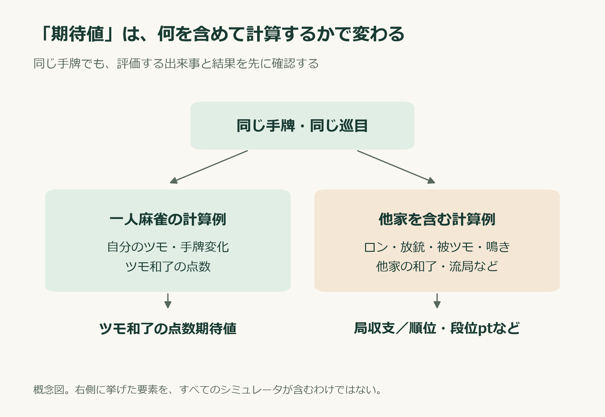
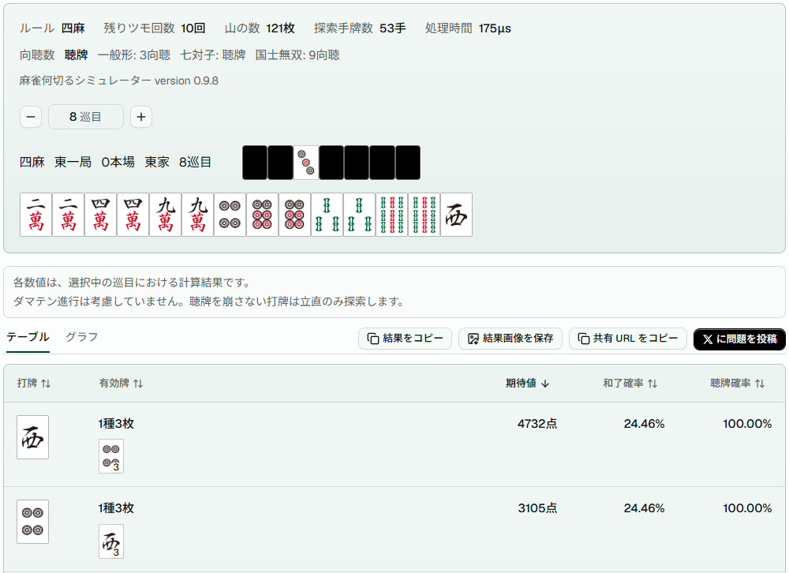
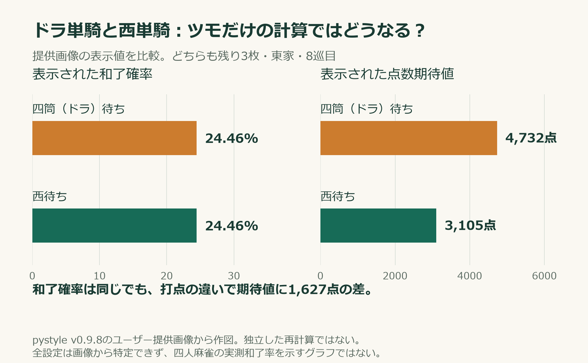
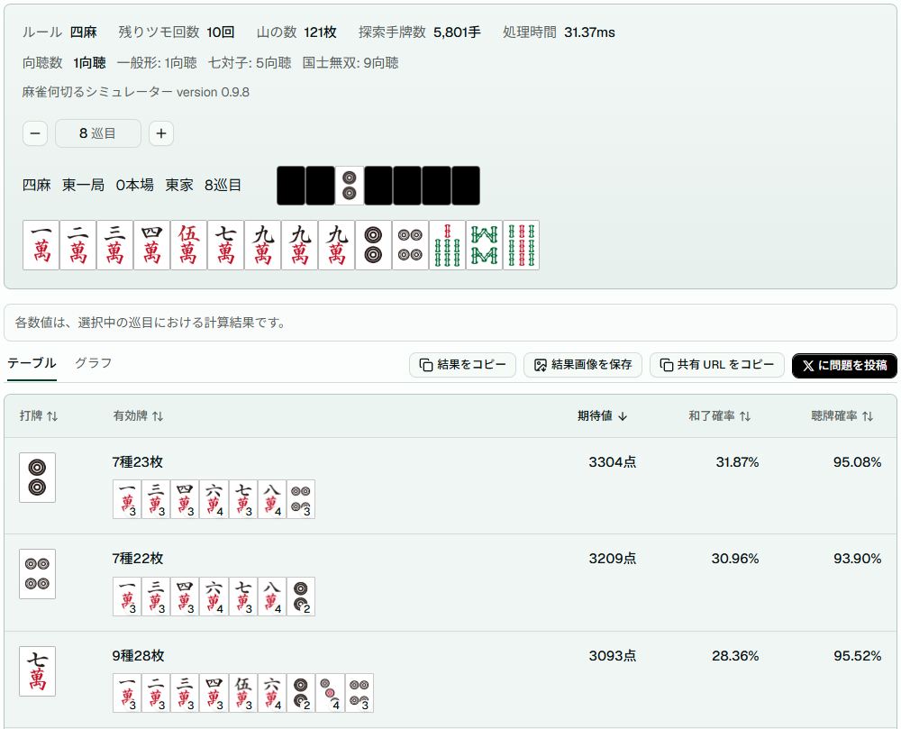
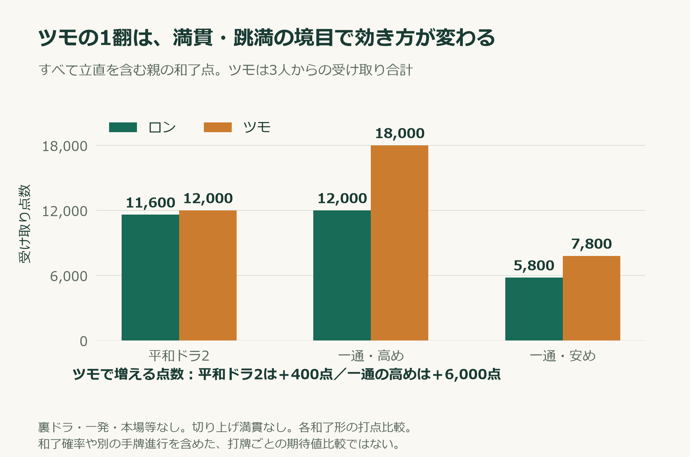
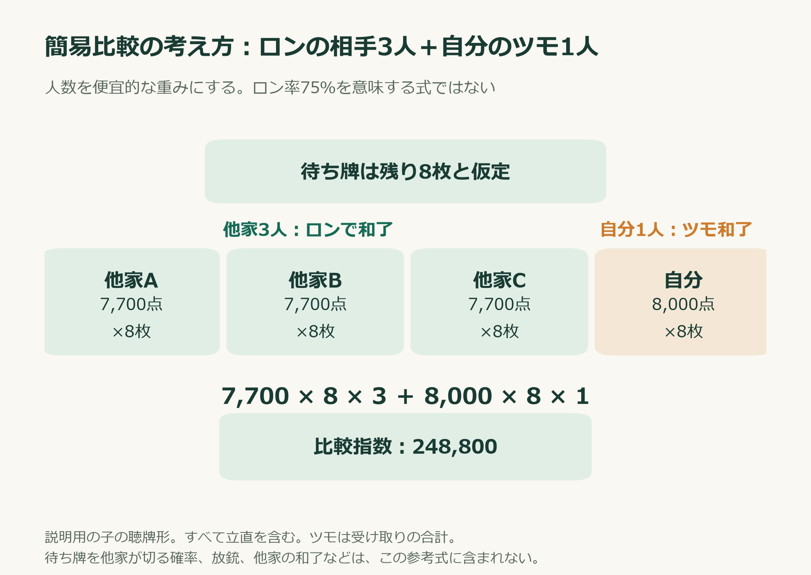
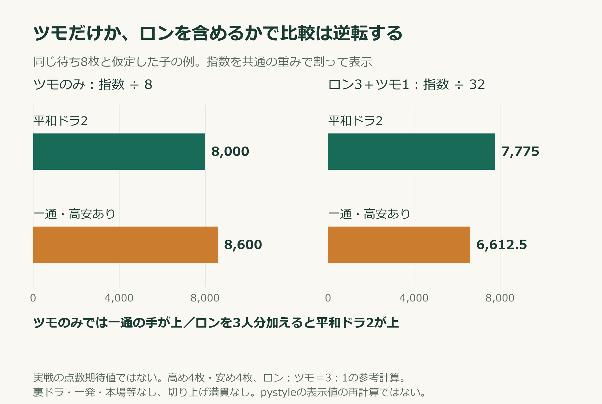
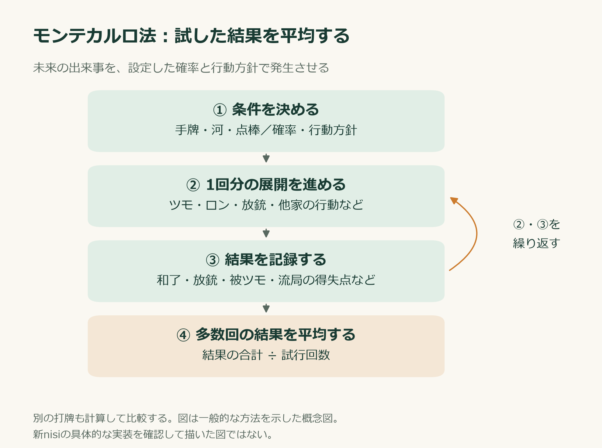
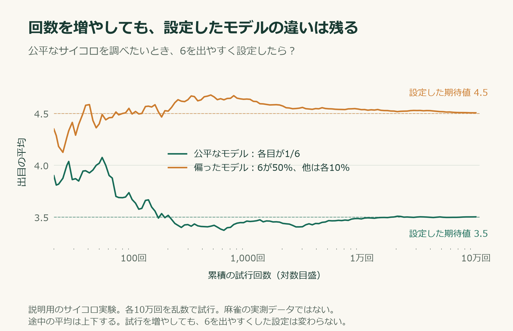

# その「期待値」、実戦の何を計算していますか？

**麻雀AIを信じる前に【前編】**

何切りの議論で、「こちらのほうが期待値が高い」と言われたとする。

シミュレーターの画面には、打牌ごとの点数が並んでいる。数字が出ると、答えが確定したように見える。自分の感覚と違っていても、「計算した結果なら、そちらが正しいのかもしれない」と思う。

その前に、一つ確認したい。

**その期待値は、ロンや放銃、他家の和了まで含めているのか。**

麻雀の期待値は計算できる。ただし、何を平均し、どんな条件で計算したのかを確認して読む必要がある。

今回は、pystyleの「麻雀何切るシミュレーター」と、旧nisiシミュレータの公開資料を使って、その違いを見ていく。

## 1．未来が分からなくても、期待値は計算できる

期待値とは、起こり得る結果を、それぞれの確率で重み付けした平均だ。

公平なサイコロなら、出目の期待値は、

**（1＋2＋3＋4＋5＋6）÷6＝3.5**

になる。次に何が出るかは分からないし、3.5という目もない。それでも期待値は計算できる。[UC Berkeleyの確率教材](https://www.stat.berkeley.edu/pub/users/stark/SticiGui/Text/expectation.htm)

麻雀でも同様に、ある打牌の後に起こる展開と、その確率を定めれば、期待値を計算できる。選ばなかった打牌の未来を実際に観測できることは、計算の条件ではない。

難しいのは、実戦で起こる展開の確率をどう決めるかだ。

見えない山や他家の手牌をどう想定するのか。相手はリーチを受けたらどれくらい降りるのか。自分は次に危険牌を引いても押すのか。そうした条件によって、同じ最初の打牌の評価も変わる。

## 2．「何の期待値か」を先に確認する

麻雀では、和了点も局収支も順位も、期待値の対象になる。

| 評価するもの | 数える結果 |
| --- | --- |
| ツモ和了の点数期待値 | ツモ和了で得る点数。和了しない展開の扱いもモデルで決める |
| 局収支の期待値 | 和了の得点、放銃・被ツモの失点、流局時の得失点など |
| 最終順位・段位ptの期待値 | 半荘終了時の順位や、その順位でもらうポイント |

「和了したときの平均打点」は、和了したケースだけの平均で、和了確率まで含む期待値とも異なる。

高い手を作りやすい打牌でも、相手に先に和了されやすいかもしれない。局収支では有利でも、ラスを避けたい点棒状況では別の選択が有利になるかもしれない。

**同じ「期待値」という言葉でも、評価している結果が違えば、答えが変わり得る。**



## 3．pystyleが計算するのは「一人麻雀」

[pystyleの麻雀何切るシミュレーター](https://pystyle.info/apps/mahjong-nanikiru-simulator/)は、手牌、ドラ、巡目などを入力して、打牌ごとの聴牌確率・和了確率・点数期待値を比較できるツールだ。

公開された計算方法は、自分のツモによって手牌が変わる過程を扱う一人麻雀モデル。状態ごとの将来の値を、終了巡目から逆向きに求める「動的計画法」を使う。名前にシミュレーターとあっても、必ずしも乱数で対局を大量に繰り返す方式とは限らない。[公開解説](https://github.com/nekobean/mahjong-cpp/blob/8971e700ff80e5f1300e48595ce902831bfe7a3a/docs/expected_score_calculation.md)

確認した公開コードでは、和了点をツモ和了として計算している。自分のツモと手牌変化を追う一方、他家からのロン、他家の和了による局の終了、放銃といった出来事を、この期待値計算には含めていない。[和了点計算の公開コード](https://github.com/nekobean/mahjong-cpp/blob/8971e700ff80e5f1300e48595ce902831bfe7a3a/src/mahjong/core/expected_score_calculator.cpp#L218)

つまり、読むべきなのは、**「この一人麻雀モデルでは、こちらの打牌の数値が高い」**という結果だ。

この数字だけで四人麻雀の打牌を断罪するには、計算から外した要素の検討が足りない。

## 4．ドラ単騎と西単騎の和了確率が、同じになる

七対子で、ドラの四筒と西のどちらを単騎待ちにするか。六対子があり、四筒と西が1枚ずつ残っている牌姿を考える。

提供されたpystyleの結果画像では、こう表示されていた。



| 打牌 | 残る待ち | 残り枚数 | 表示された和了確率 | 点数期待値 |
| --- | --- | ---: | ---: | ---: |
| 西 | ドラの四筒 | 3枚 | 24.46％ | 4,732点 |
| 四筒 | 西 | 3枚 | 24.46％ | 3,105点 |



どちらも残り3枚で、表示された和了確率は同じ。ドラ単騎で和了するとドラが対子の2枚になるため、打点面の利点が数字に表れる。

しかし実戦では、他家がその牌を切るかどうかも関係する。

ドラを抱える相手から、四筒が出るとは限らない。手に不要な西なら切る相手もいる。河や他家の手作りによっても変わる。**その「出やすさ」の違いを計算に入れなければ、結果にも現れない。**

この24.46％は、四人麻雀の実測で両待ちの和了率が同じだったという数字ではない。

ドラ単騎の打点と、西単騎のロン機会を合わせて比べて、初めて実戦の判断に近づく。この画像だけで西待ちが最善だと確定するわけでもない。

※数値はユーザー提供画像の読み取り。東家・8巡目・version 0.9.8。画像に写っていない全設定は特定できておらず、独立した再計算はしていない。

## 5．ツモの1翻は、どの手にも同じようには効かない

もう一つ、打点に注目した例を見よう。

手牌は、萬子が「一二三四赤五七九九九」、筒子が「二四」、索子が「五六七」。ドラは三筒。東家の例だ。



提供画像の表示上は、二筒切りの期待値が3,304点、七萬切りが3,093点だった。ここでは、その後に到達できる二つの聴牌形に注目する。

- **七萬切り → 三筒ツモ → 九萬切り**：三・六萬待ち。どちらで和了しても、立直・平和・ドラ2。
- **二筒切り → 八萬ツモ → 四筒切り**：三・六萬待ち。六萬なら立直・平和・一通・ドラ1。三萬には一通が付かない。

親の和了点は、次のようになる。裏ドラ・一発・本場等を加えず、切り上げ満貫を採用しない比較だ。[点数表](https://dourenmei.com/score-table/)

| 和了形（すべて立直を含む） | ロン | ツモの合計 |
| --- | ---: | ---: |
| 平和ドラ2 | 11,600点 | 12,000点 |
| 一通の高め・平和ドラ1 | 12,000点 | 18,000点 |
| 一通の安め・平和ドラ1 | 5,800点 | 7,800点 |



平和ドラ2は、ロンなら4翻30符。ツモの1翻が付くと5翻になるが、増えるのは400点だ。

一方、一通の高めは、ロンなら5翻の満貫。ツモで6翻になると跳満へ上がり、6,000点増える。

**平和ドラ2と一通の高めの打点差は、ロンでは400点、ツモでは6,000点になる。**

子なら、平和ドラ2はロン7,700点・ツモ8,000点。一通の高めはロン8,000点・ツモ12,000点だ。満貫と跳満の境目で、同じ「ツモの1翻」の効き方が大きく変わる。

だから、ツモだけを評価すると、一通の高めの打点上昇が比較の中で強く効く。ロンを含めれば、この相対評価は変わり得る。

ただし、これは二つの和了形の打点比較だ。最初の打牌の優劣を決めるには、そこに至る確率、一通が付かない安め、別の手牌進行も含める必要がある。画像の期待値差211点を、すべてこの打点差で説明できたわけではない。

### 参考：ロン3人＋ツモ1人で比べる

ロンとツモの両方を意識した、簡易比較の考え方を紹介したい。次の式で、和了形の打点と待ち枚数を組み合わせる。

**比較指数＝ロンの打点×待ち枚数×3人＋ツモの打点×待ち枚数×1人**

他家3人の打牌からはロンでき、自分が引けばツモ和了になる。この人数を、便宜的に「3対1」の重みにする考え方だ。ツモの打点には、3人から受け取る点数の合計を入れる。

これは「実際の和了の75％がロン、25％がツモ」という統計を表す式ではない。他家が待ち牌を引いても、それを切るとは限らないからだ。

ここからは上の牌姿そのものの再計算ではなく、考え方を説明するための子の例にする。待ち牌は残り8枚、高めと安めがある手は4枚ずつと仮定する。実際の待ち枚数は、自分の手牌や河などに見えている牌を差し引いて数える。裏ドラ・一発・本場等は加えず、切り上げ満貫も採用しない。

以下の図では、残り8枚の待ちについて、他家3人からのロンと自分のツモを並べている。



### 計算例①：立直・平和・ドラ2

どちらの待ちでも同じ打点で、子のロンは7,700点、ツモは合計8,000点になる。[点数表](https://dourenmei.com/score-table/)

- ロン分：**7,700×8枚×3人＝184,800**
- ツモ分：**8,000×8枚×1人＝64,000**
- 合計：**248,800**

### 計算例②：一通の高め4枚、安め4枚

立直・平和・ドラ1に、高めだけ一通が付く手を考える。子の高めはロン8,000点・ツモ12,000点、安めはロン3,900点・ツモ5,200点になる。

- 高めのロン：**8,000×4枚×3人＝96,000**
- 安めのロン：**3,900×4枚×3人＝46,800**
- 高めのツモ：**12,000×4枚×1人＝48,000**
- 安めのツモ：**5,200×4枚×1人＝20,800**
- 合計：**211,600**

ツモ分だけなら、平和ドラ2の64,000に対し、一通の手は68,800で上回る。ところがロンを3人分加えると、平和ドラ2が248,800、一通の手が211,600となり、この参考式での優劣が逆転する。

指数を共通の重みで割って見やすくしたのが、次の図だ。ツモのみは8で、ロン3人＋ツモ1人は32で割っている。前者では8,000対8,600、後者では7,775対6,612.5になる。この数字も、実戦の局収支の期待値ではない。



**平和ドラ2の利点は、ツモで高打点になることだけでなく、どちらの待ちをロンしてもほぼ満貫を取れることにある。** 一通の手は、高めツモの跳満が魅力でも、安めのロンは3,900点だ。この違いは、ツモだけの打点比較では十分に表れない。

### この参考式で省略しているもの

人数だけでは、ロンの機会を正確に表せない。ドラを抱える相手もいれば、リーチに対して降りる相手もいる。字牌と中張牌でも出やすさは違う。また、他家に先に和了される展開や、自分が放銃する失点、和了までの巡目も、この式には入っていない。

したがって248,800や211,600は、**確率で正規化する前の比較指数**だ。その点数を平均して得られる、という意味ではない。ロンとツモの打点差を見落とさないための参考情報として使い、実戦の期待値を求めるときは、各和了の確率や失点などを別に組み込む必要がある。

### GitHubで確認：pystyleはこのロン込み比較をしているか

公開コードの`calc_score`関数では、立直の有無にかかわらず、ツモ和了を指定する`WinFlag::Tsumo`を付けて点数計算を呼び出している。[和了点計算の212〜242行](https://github.com/nekobean/mahjong-cpp/blob/8971e700ff80e5f1300e48595ce902831bfe7a3a/src/mahjong/core/expected_score_calculator.cpp#L212-L242)

```cpp
int win_flag = riichi ? (WinFlag::Tsumo | WinFlag::Riichi) : WinFlag::Tsumo;
```

待ち牌を引いた遷移に付ける和了点も、この関数で求める。確認した期待値計算では、他家3人からのロンを別の和了経路として加算していない。[ツモ遷移の394〜433行](https://github.com/nekobean/mahjong-cpp/blob/8971e700ff80e5f1300e48595ce902831bfe7a3a/src/mahjong/core/expected_score_calculator.cpp#L394-L433)

このコードの構造から、一通の高めをツモして子の12,000点になる打点上昇は、計算対象に入ると読み取れる。平和ドラ2のツモ8,000点も計算対象だ。一方、平和ドラ2をロンして7,700点を得る展開は、期待値に追加されない。

**ツモの高めが跳満になる利点は評価するが、ロンでもほぼ満貫を取れる利点を、ロンの和了機会としては足していない。** これが公開コードから確認できる、今回の比較で押さえたい点だ。

なお、掲載した画面は親なので、一通の高めツモは18,000点、平和ドラ2のツモは12,000点に対応する。上の簡易計算は子に置き換えた説明例であり、pystyleの表示値3,304点・3,093点を再計算したものではない。公開コードとWebアプリの配置版が一致するかも、未確認のままだ。

## 6．他家を組み込む：モンテカルロ法と旧nisi

他家を含む期待値を推定する方法の一つが、モンテカルロシミュレーションだ。

**確率に従って試行を繰り返し、結果の平均や発生率を調べる方法**である。[モンテカルロ法の入門資料](https://www.informs-sim.org/wsc08papers/012.pdf)



例えば、ある打牌の後を試して、和了で＋8,000点、放銃で−3,900点、被ツモで−2,000点、得失点0の展開が2回だったとする。

5回の平均は、**（8,000−3,900−2,000＋0＋0）÷5＝＋420点**。これは説明用の小さな例だが、多数回の試行から平均を推定する考え方は同じだ。

「ランダムに試す」は、すべての出来事を同じ確率にする意味ではない。他家がドラを切る確率や、リーチを受けて降りる確率などを設定し、その確率に応じて展開を発生させられる。

旧nisiの無料公開概要には、自分のツモとロンの確率、ドラ待ちの出にくさ、他家のリーチ・副露、放銃・被ツモ・横移動・流局などの処理が書かれている。最終順位を求めるために、以降の局の点棒移動も試す。[作者の概要解説](http://epsilon69399.blog20.fc2.com/blog-entry-478.html)、[詳細な概要テキスト](http://blog-imgs-72.fc2.com/e/p/s/epsilon69399/20150703190030994.txt)

つまり、シミュレーターによって、どこまで麻雀を含めるかは違う。本稿が参照するnisiの具体的な手順は2015年の旧版の資料で、新nisiの現行実装を確認した説明ではない。

## 7．100万回試しても、仮定の違いは残る

試行回数が増えると、乱数の出方によるブレは一般に小さくなる。

だが、仮定が実戦からずれていれば、その仮定に従った結果が安定する。

公平なサイコロの平均を調べたいのに、「6が50％、他の目はそれぞれ10％」というモデルを作ったとしよう。このモデルの期待値は4.5だ。何度試しても、公平なサイコロの期待値3.5を推定するモデルには変わらない。



麻雀でも、他家がどの牌を抱え、何を切り、どんな条件で押すか。そのモデルが変われば、計算結果も変わる。

nisi氏自身も、試行回数を増やして乱数による誤差を減らしても、モデルが実際の麻雀と離れていれば解決しないと説明している。[作者の説明](https://note.com/mahjong_math/n/nc10eb36c26aa)

**「100万回計算した」と聞いたら、「どんな麻雀を100万回試したのか」まで知りたい。**

## 8．数字を根拠にするなら、前提も示してほしい

期待値の数字を見たら、次の点を確認したい。

- 何を平均した数字か。和了点か、局収支か、最終順位か。
- ロン、放銃、他家の和了などを含むか。
- 自分と他家の、その後の打ち方をどう決めているか。
- どんなルール・巡目・残り枚数・設定で計算したか。

一人麻雀の計算は、手牌進行や打点の違いを調べる材料になる。その結果を四人麻雀の判断に使うなら、ロンの出やすさや放銃など、追加で考える要素を明らかにする必要がある。

**「期待値が高い」と言うだけでは、他人の打牌を否定する根拠が足りない。どんな条件で、何の期待値が高いのかまで示してほしい。**

では、その後の打ち方そのものを学習したAIなら、その推奨を正解として扱ってよいのか。

次回はNAGAなどの麻雀AIを取り上げ、学習方法、対局成績、評価指標を確認する。

---

調査時点：2026-09-26。pystyleのコードはコミット `8971e700ff80e5f1300e48595ce902831bfe7a3a`を参照。公開コードとWebアプリの配置版が一致するかは未確認。提供画像の表示値、点数表による打点比較、説明用のサイコロ実験を区別して掲載した。図は本文のために作成したもの。
