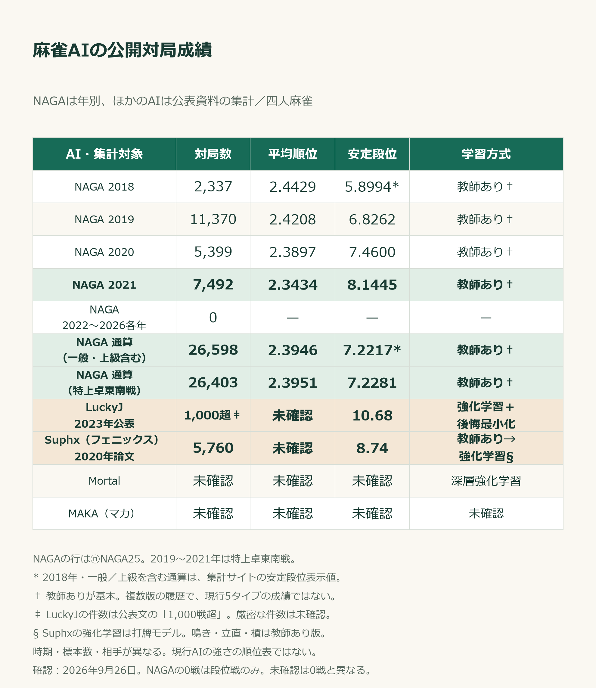
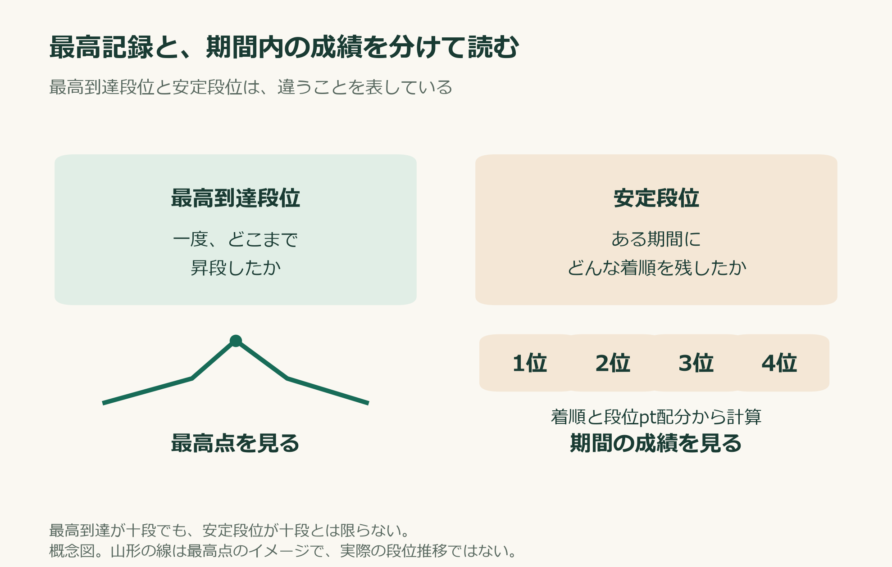
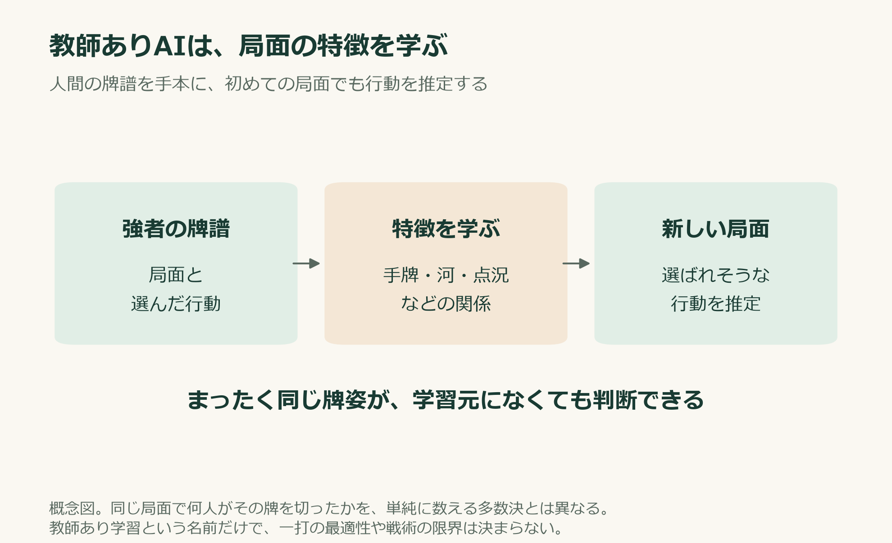
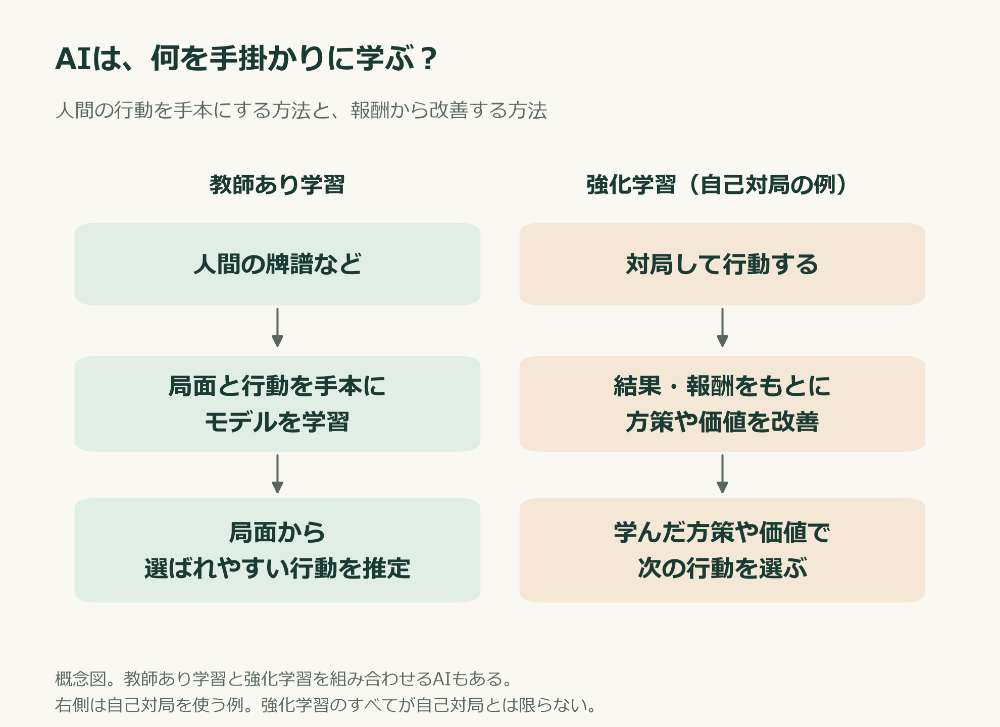
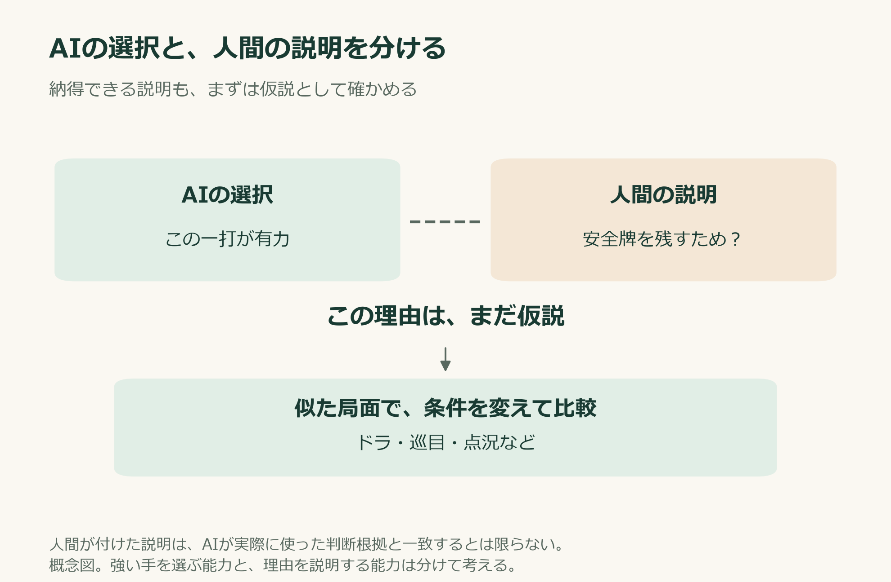
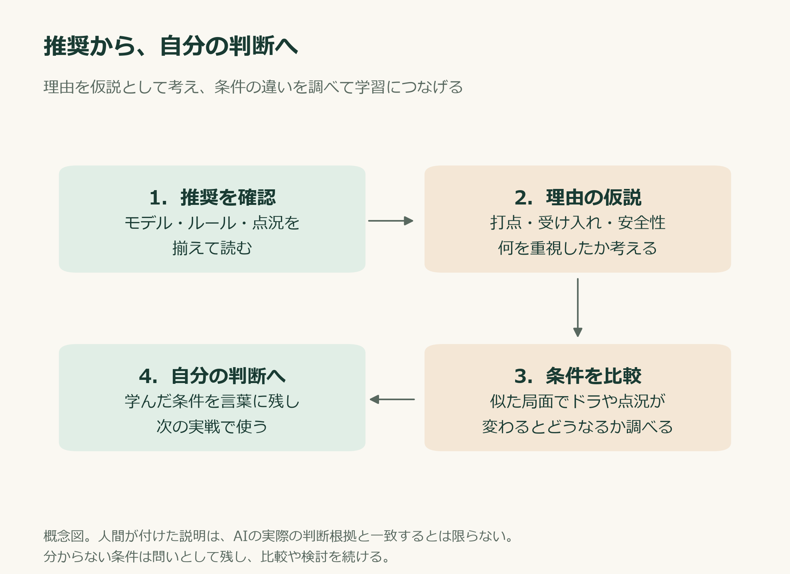
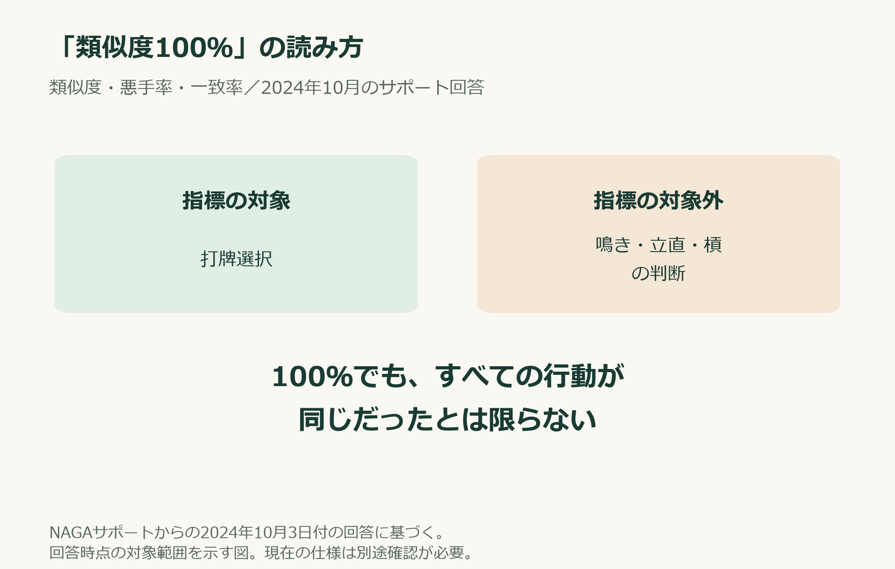

# AIの一打は「神の一手」なのか？

**麻雀AIを信じる前に【後編】**

AIの推奨と違う牌を切った。

その瞬間、「間違えた」と思ってしまうことはないだろうか。

自分なりに受け入れや打点、安全性を考えた一打でも、解析画面に別の推奨が出ると自信がなくなる。強いAIが選んだのだから、そちらに理由があるはずだ。そう考えること自体は自然だと思う。

ただ、そこで立ち止まって、なぜ判断が分かれたのかを考えてみたい。

[前編](https://note.com/nifty_yak8361/n/ndcbd19462560)では、麻雀の「期待値」が、計算に含める出来事や仮定によって変わることを見た。

今回は、その先にある麻雀AIの話だ。何を学んだAIなのか。強いことと、一打の理由が分かることはどう違うのか。そして、私たちはその推奨から何を学べるのか。

## 「十段到達」と「安定段位」は、同じ数字ではない

「十段に到達したAI」と聞くと、その推奨がほとんど正解に思えるかもしれない。

だが、最高到達段位と、一定期間の着順から求める安定段位は別の指標だ。まず、NAGAの公開対局アカウント「ⓝNAGA25」の年別成績と、ほかの麻雀AIの公表成績を見てみよう。

**通算26,598戦の安定段位は7.2217段。2021年単年では8.1445段だった。**

十段到達の実績があっても、通算の安定段位が十段になるわけではない。一方、年別では成績が改善しており、通算値だけで最後のモデルの強さを判断することもできない。

平均順位は小さいほどよく、安定段位は着順分布と段位pt配分から求める成績指標だ。「一度どこまで到達したか」と、「この期間にどんな成績を残したか」を分けて読んでほしい。

出典：[天鳳IDログ検索：ⓝNAGA25](https://nodocchi.moe/tenhoulog/#!&name=%E2%93%9DNAGA25)。四人麻雀の段位戦に絞り、各年末の累計着順から年別を再集計した。確認日は2026年9月26日。

※2018年と通算には一般卓・上級卓195戦が含まれ、安定段位は集計サイトの表示値を採用した。混在する卓の内部算式は独立検証していない。2019〜2021年はすべて特上卓東南戦。2026年は確認時点まで。0戦は段位戦の件数であり、個室・イベント対局を含まない。

※この履歴にはモデル更新が含まれる。現在のニシキ・カガシなど5タイプそれぞれの成績ではない。公式には、現行タイプが旧十段達成モデルより強いという対戦検証も示されている。[NAGA公式の性能比較](https://note.com/naga_project/n/n61a012f27261)

ほかのAIでは、LuckyJが安定段位10.68段、Suphx（フェニックス）が8.74段と公表されている。比較用に、NAGAを特上卓東南戦だけに絞った通算26,403戦・平均順位2.3951・安定段位7.2281段も載せた。

ただし、対局時期、使用モデル、対戦相手、標本数が揃った比較ではない。**この表から現在の各AIの強さの順位を決めることはできない。未確認は、弱いことを意味しない。**

- **LuckyJ**：安定段位10.68段は2023年の開発側公表値。対局数は公表文にある「1,000戦超」とし、その安定段位の対象となった厳密な件数は未確認とした。強化学習と後悔最小化を組み合わせている。[Tencent発表の許諾訳](https://modern-jan.com/blog/luckyj_article_ja/)
- **Suphx**：2020年論文の表4に5,760戦・安定段位8.74段が掲載されている。人間牌譜による教師あり学習の後、打牌モデルを強化学習で改善。鳴き・立直・槓のモデルは教師あり版を使う。[開発元論文](https://arxiv.org/pdf/2003.13590)
- **Mortal**：学習方式は深層強化学習。開発者は天鳳でのAIアカウント申請が拒否されたと説明しており、公認段位戦の実測成績は確認できていない。[公式リポジトリ](https://github.com/Equim-chan/Mortal)、[開発者FAQ](https://github.com/Equim-chan/mjai-reviewer/blob/master/faq.md)
- **MAKA**：今回確認した公開資料から、学習方式と天鳳の公認段位戦成績を特定できていない。推測で教師あり学習に分類せず、未確認とした。[雀魂公式のサービス告知](https://mahjongsoul.com/news/254)

**「十段AIの推奨だから、この一打も正解」と結論づける前に、どのモデルの、どんな実績なのかを確認したい。**

## 1．AIと意見が違ったとき、何を学べるか

AIを使う大きな価値の一つは、自分が見落とした選択肢を見つけられることだ。

受け入れを増やす手だけを考えていたら、AIは安全牌を残す。打点を追っていたら、早い和了を重視する。あるいは、自分には意外な手順を選ぶ。

その違いには、検討する価値がある。

一方で、最初の推奨だけを覚えても、似た局面で使えるとは限らない。ドラが違う、巡目が違う、相手がリーチしている、オーラスの点況が違う。牌姿が似ていても、判断に関わる条件は変わる。

「この形ならこの牌」と覚える前に、どの条件でその選択が有力になるのかを知りたい。

**AIの推奨と違った局面は、自分の判断を振り返るためのよい題材になる。**

## 2．NAGAは、人間の強者の判断から学んだAI

NAGAは、公開された説明によると、天鳳の高段位者の牌譜から打牌や副露などを学習している。2025年のドワンゴの発表でも、高レベルなプレイヤーをモデルにした、戦術の異なる5タイプのAIとして紹介されている。[ドワンゴの説明](https://dwango.co.jp/news/6454281032957952/)

基本となるのは、人間の行動を手本にする教師あり学習だ。

2019年の開発者解説では、手牌、河、副露、点数などを入力し、どの牌を捨てるかの分布を出力する仕組みが説明されている。局面の特徴から、学習元の人間が選びそうな行動を推定する、と捉えると分かりやすい。[開発者解説](https://dmv.nico/ja/articles/mahjong_ai_naga/)

同じ牌姿を数える多数決ではなく、初めて見る局面にも、学んだ特徴を使って判断する。

人間の強者が実戦で積み上げた判断を、自分の牌譜に照らして確認できる。攻める局面と降りる局面、自分が重視しなかった打点や安全性に目を向ける。その用途で、NAGAは心強い検討相手になる。

ただし、人間の行動を学習したことだけで、すべての一打の最適性が証明されるわけではない。教師あり学習という名前だけで、見つけられる戦術の限界を決めることもできない。

まずは、**人間の強者の知見から学んだAIの意見**として受け取り、判断の違いを調べていきたい。

※ここでは公開説明上の基本を紹介している。現在のすべてのバージョンの詳しい学習工程を確認した説明ではない。

## 3．人間の常識に縛られず、戦略を学ぶAI

AIの学習方法には、強化学習もある。

行動した結果、どんな報酬を得たか。それを手掛かりに、行動の選び方や価値の推定を改善する方法だ。人間の行動を学ぶ方法と組み合わせることもある。

将棋の例では、AlphaZeroがよく知られている。AlphaZeroは自己対局の強化学習と探索を使い、将棋・囲碁・チェスで高い対局性能を示した。将棋AI全体を一つの方式でくくるのではなく、ここではこの研究を例にする。[DeepMindの解説](https://deepmind.google/blog/alphazero-shedding-new-light-on-chess-shogi-and-go/)

同じ解説では、羽生善治氏が、玉を盤の中央へ進めるなど、人間の将棋理論からは危険に見える指し手でも、AlphaZeroは局面を制御していたと述べている。

人間が思い浮かべる「自然な手」と、AIが有力と判断する手が、ずれることがある。

人間の定石に合わせることを目標とせず、対局の結果から学んだ戦略には、人間の直感からは説明しづらい選択が現れ得る。そこに、新しい考え方を学べる可能性がある。

なお、「強化学習」は学習方法の名前だ。すべての強化学習AIが、実戦の毎手番で大量の未来を探索している、という意味ではない。学習時の試行と、判断時の探索は分けて確認する必要がある。

## 4．LuckyJと「神の一手」への期待

麻雀では、LuckyJがその興味を引く存在だ。

開発元の説明では、強化学習と後悔最小化を組み合わせた自己対局学習に、不完全情報下の探索を加えている。後悔最小化は、ほかの行動を選んだ場合との差を使って戦略を改善する考え方だ。[Tencent公式発表の許諾訳](https://modern-jan.com/blog/luckyj_article_ja/)

2023年には、天鳳特上卓で安定段位10.68という成績が公表された。高い対局性能を示す実績の一つである。[担当研究者の公開ページ](https://haobofu.github.io/)

こうしたAIに期待したくなるのは、人間が見落としていた強い戦略の発見だ。

人間がよく選ぶ手と、ある条件で有利になる手が、必ず一致するとは限らない。人間の経験則からは不自然に見える一打が、先の展開まで含めると意味を持つかもしれない。

『ヒカルの碁』の「神の一手」を、そんな発見への期待に重ねたくなる。

ただ、LuckyJの高い成績から、すべての局面で完全な最適解を選ぶとまでは言えない。対局を通した強さと、個々の一打の数学的な最適性の証明は、分けて考える必要がある。

麻雀では、見えない牌をどう想定するか、相手がどう打つか、何を目標にするかが判断に関わる。局収支を重視する場面と、ラスを避けたい場面でも、選びたい手は変わり得る。

「神の一手」は、ここでは未知の強い戦略への期待を表す比喩だ。AIの肩書だけで、その一打の正しさを決めるための言葉にはしたくない。

## 5．強い手を選べることと、理由を説明できること

AIから学ぶとき、もう一つ考えたいことがある。

**AIがその手を選ぶことと、人間がその理由を理解できることは、同じではない。**

例えば、解析を見た人が「これは安全牌を残すためだ」と解説したとする。筋が通っていれば、学習の手掛かりになる。

ただ、その説明は、人間が立てた仮説でもある。AIが実際にどの情報を使い、何を重視して選んだのかまで、その一文で確認できたとは限らない。

受け入れ、打点、安全性、相手の動き、点況。その複数の要素が合わさった判断を、短い一言で説明しようとすると、条件が抜けることもある。

そこで、似た局面でドラや点況が変わったとき、推奨がどう変わるかを調べる。安全性が理由だと思ったなら、危険度が違う局面でも同じ説明が通るか考える。自分の説明を、比較を通して確かめていく。

説明の研究も進んでいる。AlphaZeroから新しいチェスの概念を抽出し、トップ棋士が学べるかを調べた研究では、提示された局面を解く成績の改善が報告されている。[知識の抽出・人間への移転研究](https://arxiv.org/abs/2310.16410)

NAGAの開発者解説にも、入力のどの特徴が選択に影響するかを可視化する取り組みがある。[判断根拠の可視化](https://dmv.nico/ja/articles/mahjong_ai_naga/)

こうした進歩は、人間がAIから学べる可能性を広げている。一方、これらの研究だけで、LuckyJなどの個々の打牌を十分に説明できる機能が確立したとは言えない。

推奨を受け取り、理由の仮説を作り、条件を比較する。その過程にも、牌譜検討の価値がある。

## 6．牌譜検討で、AIの数字をどう読むか

解析画面の数字は、それぞれ意味を確認して使いたい。

推奨度、一致率、類似度、価値の推定値。似た画面に表示されていても、同じものを測っているとは限らない。

例えば、MortalのレビューFAQでは、行動選択確率の低さを、その手が劣る量として読むのは適切でないと説明している。Q値も、局収支の点数そのものとは区別されている。[MortalレビューFAQ](https://github.com/Equim-chan/mjai-reviewer/blob/master/faq.md)

また、私がNAGAサポートへ問い合わせた際、2024年10月3日付の回答では、類似度・悪手率・一致率の対象は打牌選択で、鳴き・立直・槓の判断は対象外だと説明された。

これは、NAGAがそれらを推奨する機能と、3指標の集計対象が異なるという話だ。類似度100％から、すべての行動が同じだったとは読めない。回答時点の説明として紹介しておく。

NAGAには複数のタイプもある。2023年の公式記事に掲載された、2020年5月の局面を対象とする集計では、ニシキとカガシの推奨打牌は13.1％異なっていた。この不一致率は、どちらかの誤り率を表す数字ではない。[NAGA公式の説明](https://note.com/naga_project/n/n61a012f27261)

タイプによって、重視する戦略や打ち筋が違う。判断が分かれた局面は、何を優先すると選択が変わるのかを考える材料になる。

同じ公式記事では、NAGAの判断を「一人の強者の意見」として見るよう説明している。AIとの違いを、自分の考え方を広げる機会にする。この読み方は、日々の検討でも使いやすいと思う。

### 手出し・ツモ切りの仕様について

現行NAGAが、他家の手出し・ツモ切り情報を打牌判断にどう利用しているかは、現時点では確認できていない。

入力に区別が含まれるか、危険度などの予測表示に影響するか、最終的な打牌選択に使うかは、それぞれ確認が必要な点だ。

## 7．AIから学び、自分の判断を育てる

AIの推奨が自分と違ったら、次のように検討してみたい。

- どのモデルで、どんなルール・点況の解析かを確認する。
- 自分は何を重視し、どの選択肢を見落としたかを書き出す。
- AIの推奨について、打点・受け入れ・安全性などの理由を仮説として考える。
- その後の手牌進行や、似た局面での判断も調べる。
- 学んだ条件を、自分の言葉で短く残す。

例えば、「安全牌を残す」とだけ覚えると、攻める価値の高い手でも同じことをしてしまうかもしれない。どんな手牌で、どの巡目で、何を失って安全牌を持つのか。そこまで考えると、次の実戦で選択しやすくなる。

前編の一人麻雀の計算も、今回の麻雀AIも、考える材料を増やしてくれる。

理解しづらい一打に出会ったら、すぐには説明できないことをそのまま認めてもよい。分からない条件を調べ、ほかの人の考察を読み、自分でも比較する。その過程で学べることがある。

**AIの一打を見たら、そこから自分の麻雀を考える。**

強いAIほど、その判断から学べることも多い。推奨を受け取り、自分の経験と照らし合わせ、次の判断に生かす。そんな使い方を続けていきたい。

## 補足：AIを倒しにいく人間が熱い。『龍と苺』は超おすすめ

最後に、この話題でぜひ紹介したい漫画がある。

柳本光晴さんの**『龍と苺（りゅうといちご）』**だ。

将棋のルールを知らなかった14歳の少女・藍田苺が、将棋の世界へ挑んでいく物語。人間が強い相手へ正面から向かっていく熱量が、この作品の魅力だと思う。[小学館による作品紹介](https://prtimes.jp/main/html/rd/p/000000670.000013640.html)

詳しい展開は伏せるが、物語はAIとの対決にも進んでいく。人間がAIへ挑み、勝ちをもぎ取る。この記事のテーマに興味を持った人には、その勝負の熱さもぜひ楽しんでほしい。[AIとの対決を紹介する出版社のページ](https://shogakukan-comic.jp/book?isbn=9784098545353)

AIが強いと分かっていても、目の前の勝負を諦めずに考え、挑む。その姿には、盤や卓に向かう人間を応援したくなる力がある。

将棋や麻雀で考えることが好きな人、人間とAIの勝負に胸が熱くなる人に、**超おすすめです。**

[『龍と苺』のコミックス一覧・試し読みはこちら](https://shogakukan-comic.jp/book-series?cd=49548)

---

資料確認：2026年9月26日。AIの方式・性能は参照した公開資料の時点と対象に限る。図は学習方法と牌譜検討の概念図。漫画紹介にはAIとの対決に進むことへの言及を含むが、詳しい経緯や結末は紹介していない。
